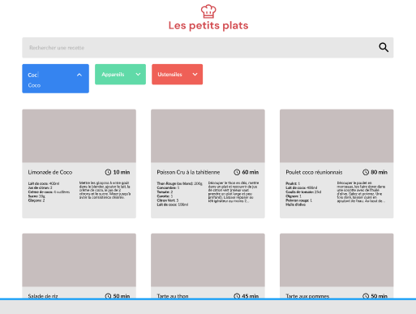

<!-- Improved compatibility of back to top link: See: https://github.com/othneildrew/Best-README-Template/pull/73 -->

<a name="readme-top"></a>

<!-- PROJECT SHIELDS -->
<!--
*** I'm using markdown "reference style" links for readability.
*** Reference links are enclosed in brackets [ ] instead of parentheses ( ).
*** See the bottom of this document for the declaration of the reference variables
*** for contributors-url, forks-url, etc. This is an optional, concise syntax you may use.
*** https://www.markdownguide.org/basic-syntax/#reference-style-links
-->
<!--
[![Contributors][contributors-shield]][contributors-url]
[![Forks][forks-shield]][forks-url]
[![Stargazers][stars-shield]][stars-url]
[![Issues][issues-shield]][issues-url]
[![MIT License][license-shield]][license-url]
[![LinkedIn][linkedin-shield]][linkedin-url]

<!-- PROJECT LOGO -->
<br />
<div align="center">
  <h1 align="center">Développez un algorithme de recherche en JavaScript</h1>

  <p align="center">
    Open-Classroom, P7/14, Formation Développeur Front-End, Javascript React mars2022/mai2023
    <br />
    <!--<a href="https://github.com/othneildrew/Best-README-Template"><strong>Explore the docs »</strong></a>
    <br />
    <br />
    <a href="https://github.com/othneildrew/Best-README-Template">View Demo</a>
    ·
    <a href="https://github.com/othneildrew/Best-README-Template/issues">Report Bug</a>
    ·
    <a href="https://github.com/othneildrew/Best-README-Template/issues">Request Feature</a> -->
  </p>
</div>

<!-- TABLE OF CONTENTS -->
<details>
  <summary>Table des matières</summary>
  <ol>
    <li><a href="#P7-:-Les-Petits-Plats"> P7 : Les Petits Plats</a>
    <ul>
      <li><a href="#Résultat">Résultat</a></li>
      <li><a href="#Scénario">Scénario</a></li>
      <li><a href="#Objectif">Objectif</a></li>
      <ul>
        <li><a href="#Description-des-fonctionnalités-de-recherche">Description des fonctionnalités de recherche</a></li>
        <li><a href="#Etapes">Etapes</a></li>
        <li><a href="#Les-conditions-supplémentaires">Les conditions supplémentaires</a></li>
        <li><a href="#Etapes">Etapes</a></li>
      </ul>
      <li><a href="#Built-With">Built With</a></li>
    </ul>
    </li>
  </ol>
</details>

<!-- ABOUT THE PROJECT -->

## P7 : Les Petits Plats

### Résultat

<a href="https://supersandrine.github.io/P-7-Les-petits-plats/search.html">Le résultat du projet "Les Petits Plats"</a>

### Scénario

Vous êtes missionnés par l’entreprise “Les petits plats” en temps que Développeur Front-end.
L'entreprise, éditrice de livre de cuisine, veut réaliser son propre site de recettes de cuisine à l’instar de Marmiton ou 750g.
La différenciation de ce produit est basée sur la fluidité du moteur de recherche.

Votre première mission sera donc d’implémenter la fonctionnalité de recherche, avec comme ressource :

- <a href="https://www.figma.com/file/xqeE1ZKlHUWi2Efo8r73NK/UI-Design-Les-Petits-Plats-FR?node-id=1%3A2">Les maquettes sur Figma</a>
- <a href="./readmeAssets/Cas+d’utilisation+Filtrer+les+recettes+dans+l’interface+utilisateur.pdf">La descrtiption du cas d'utilisation de recherche</a>
- <a href="./data/recipes.js">Un fichier contenant une base de 50 recettes</a>



<p align="right">(<a href="#readme-top">back to top</a>)</p>

### Objectif

Faire deux implémentations différentes de la fonctionalité recherche pour pouvoir comparer leurs performances et choisir la meilleure.

#### Description des fonctionnalités de recherche

L'utilisateur du site peut faire une recherche selon deux champs:

- le champs de recherche principal
- les champs de recherches avancées

Le champs de recherche principal est une barre de recherche qui va retrouver la chaîne de 3 caractères minimums, si elle est présente et renvoyer une liste de recettes contenant cette chaîne, sinon, afficher un message d'erreur.

Les champs de recherches avancées, va chercher par mots-clefs sélectionnés les recettes correspondant à l'intersections de ces mots-clefs.

<p align="right">(<a href="#readme-top">back to top</a>)</p>

#### Etapes

- Implémenter l'interface, avec un code qui passe le validateur de W3C

- L'algorithmique en 3 étapes:
  - Planifier les 2 versions de la fonctionalité du champs de recherche principal(en boucles natives et l'autre en code fonctionnel), remplir une fiche d'investigation, avec algorigramme
  - Implémenter ces 2 versions sur 2 branches : branche master et branche NativeLoops
  - Tester les performances des 2 versions sur jsben.ch : <a href="https://jsben.ch/gUW10">voici le lien de ce test.</a>

<p align="right">(<a href="#readme-top">back to top</a>)</p>

#### Les conditions supplémentaires

En suivant <a href="./readmeAssets/Cas+d’utilisation+Filtrer+les+recettes+dans+l’interface+utilisateur.pdf">les cas d'utilisation de recherche</a>, on réponds à la majorité des contitions.
En complément les règles de gestion sont également à suivre:

1. La recherche doit pouvoir se faire via le champ principal ou via les tags (ingrédients,
   ustensiles ou appareil)
2. La recherche principale se lance à partir de 3 caractères entrés par l’utilisateur dans la
   barre de recherche
3. La recherche s’actualise pour chaque nouveau caractère entré
4. La recherche principale affiche les premiers résultats le plus rapidement possible
5. Les champs ingrédients , ustensiles et appareil de la recherche avancée proposent
   seulement les éléments restant dans les recettes présentes sur la page
6. Les retours de recherche doivent être une intersection des résultats. Si l’on ajoute les
   tags “coco” et “chocolat” dans les ingrédients, on doit récupérer les recettes qui ont à la
   fois de la coco et du chocolat.
7. Comme pour le reste du site, le code HTML et CSS pour l’interface (avec ou sans
   Bootstrap) devra passer avec succès le validateur W3C.
8. Aucune librairie ne sera utilisée pour le JavaScript du moteur de recherche

### Built With

- GitHub
- VSCode
- DrawIo [drawIo-url]
- Figma

<p align="right">(<a href="#readme-top">back to top</a>)</p>

<!-- GETTING STARTED -->
<!--
## Getting Started

This is an example of how you may give instructions on setting up your project locally.
To get a local copy up and running follow these simple example steps.

### Prerequisites

This is an example of how to list things you need to use the software and how to install them.

- npm
  ```sh
  npm install npm@latest -g
  ```

### Installation

_Below is an example of how you can instruct your audience on installing and setting up your app. This template doesn't rely on any external dependencies or services._

1. Get a free API Key at [https://example.com](https://example.com)
2. Clone the repo
   ```sh
   git clone https://github.com/your_username_/Project-Name.git
   ```
3. Install NPM packages
   ```sh
   npm install
   ```
4. Enter your API in `config.js`
   ```js
   const API_KEY = "ENTER YOUR API";
   ```

<p align="right">(<a href="#readme-top">back to top</a>)</p>

<!-- USAGE EXAMPLES -->
<!--
## Usage

Use this space to show useful examples of how a project can be used. Additional screenshots, code examples and demos work well in this space. You may also link to more resources.

_For more examples, please refer to the [Documentation](https://example.com)_

<p align="right">(<a href="#readme-top">back to top</a>)</p>
-->
<!-- ROADMAP -->
<!--
## Roadmap

- [x] Add Changelog
- [x] Add back to top links
- [ ] Add Additional Templates w/ Examples
- [ ] Add "components" document to easily copy & paste sections of the readme
- [ ] Multi-language Support
  - [ ] Chinese
  - [ ] Spanish

See the [open issues](https://github.com/othneildrew/Best-README-Template/issues) for a full list of proposed features (and known issues).

<p align="right">(<a href="#readme-top">back to top</a>)</p>
-->
<!-- CONTRIBUTING -->
<!--
## Contributing

Contributions are what make the open source community such an amazing place to learn, inspire, and create. Any contributions you make are **greatly appreciated**.

If you have a suggestion that would make this better, please fork the repo and create a pull request. You can also simply open an issue with the tag "enhancement".
Don't forget to give the project a star! Thanks again!

1. Fork the Project
2. Create your Feature Branch (`git checkout -b feature/AmazingFeature`)
3. Commit your Changes (`git commit -m 'Add some AmazingFeature'`)
4. Push to the Branch (`git push origin feature/AmazingFeature`)
5. Open a Pull Request

<p align="right">(<a href="#readme-top">back to top</a>)</p>
-->
<!-- LICENSE -->
<!--
## License

Distributed under the MIT License. See `LICENSE.txt` for more information.

<p align="right">(<a href="#readme-top">back to top</a>)</p>
-->
<!-- CONTACT -->
<!--
## Contact

Your Name - [@your_twitter](https://twitter.com/your_username) - email@example.com

Project Link: [https://github.com/your_username/repo_name](https://github.com/your_username/repo_name)

<p align="right">(<a href="#readme-top">back to top</a>)</p>
-->
<!-- ACKNOWLEDGMENTS -->
<!--
## Acknowledgments

Use this space to list resources you find helpful and would like to give credit to. I've included a few of my favorites to kick things off!

- [Choose an Open Source License](https://choosealicense.com)
- [GitHub Emoji Cheat Sheet](https://www.webpagefx.com/tools/emoji-cheat-sheet)
- [Malven's Flexbox Cheatsheet](https://flexbox.malven.co/)
- [Malven's Grid Cheatsheet](https://grid.malven.co/)
- [Img Shields](https://shields.io)
- [GitHub Pages](https://pages.github.com)
- [Font Awesome](https://fontawesome.com)
- [React Icons](https://react-icons.github.io/react-icons/search)

<p align="right">(<a href="#readme-top">back to top</a>)</p>
-->
<!-- MARKDOWN LINKS & IMAGES -->
<!-- https://www.markdownguide.org/basic-syntax/#reference-style-links -->
<!--
[contributors-shield]: https://img.shields.io/github/contributors/othneildrew/Best-README-Template.svg?style=for-the-badge
[contributors-url]: https://github.com/othneildrew/Best-README-Template/graphs/contributors
[forks-shield]: https://img.shields.io/github/forks/othneildrew/Best-README-Template.svg?style=for-the-badge
[forks-url]: https://github.com/othneildrew/Best-README-Template/network/members
[stars-shield]: https://img.shields.io/github/stars/othneildrew/Best-README-Template.svg?style=for-the-badge
[stars-url]: https://github.com/othneildrew/Best-README-Template/stargazers
[issues-shield]: https://img.shields.io/github/issues/othneildrew/Best-README-Template.svg?style=for-the-badge
[issues-url]: https://github.com/othneildrew/Best-README-Template/issues
[license-shield]: https://img.shields.io/github/license/othneildrew/Best-README-Template.svg?style=for-the-badge
[license-url]: https://github.com/othneildrew/Best-README-Template/blob/master/LICENSE.txt
[linkedin-shield]: https://img.shields.io/badge/-LinkedIn-black.svg?style=for-the-badge&logo=linkedin&colorB=555
[linkedin-url]: https://linkedin.com/in/othneildrew
[product-screenshot]: images/screenshot.png
[next.js]: https://img.shields.io/badge/next.js-000000?style=for-the-badge&logo=nextdotjs&logoColor=white
[next-url]: https://nextjs.org/
[react.js]: https://img.shields.io/badge/React-20232A?style=for-the-badge&logo=react&logoColor=61DAFB
[react-url]: https://reactjs.org/
[vue.js]: https://img.shields.io/badge/Vue.js-35495E?style=for-the-badge&logo=vuedotjs&logoColor=4FC08D
[vue-url]: https://vuejs.org/
[angular.io]: https://img.shields.io/badge/Angular-DD0031?style=for-the-badge&logo=angular&logoColor=white
[angular-url]: https://angular.io/
[svelte.dev]: https://img.shields.io/badge/Svelte-4A4A55?style=for-the-badge&logo=svelte&logoColor=FF3E00
[svelte-url]: https://svelte.dev/
[laravel.com]: https://img.shields.io/badge/Laravel-FF2D20?style=for-the-badge&logo=laravel&logoColor=white
[laravel-url]: https://laravel.com
[bootstrap.com]: https://img.shields.io/badge/Bootstrap-563D7C?style=for-the-badge&logo=bootstrap&logoColor=white
[bootstrap-url]: https://getbootstrap.com
[jquery.com]: https://img.shields.io/badge/jQuery-0769AD?style=for-the-badge&logo=jquery&logoColor=white

[drawIo-url]: https://app.diagrams.net/
